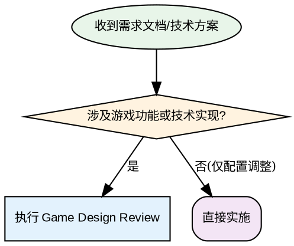

# Game Design Review

## Overview

以资深游戏策划和程序员的身份，系统化审核游戏需求文档与技术方案。从**游戏设计最佳实践**和 **ECS 架构合规性**两个维度提供结构化反馈。

## When to Use



**使用场景:**
- ✅ 收到新的功能需求文档
- ✅ 技术方案评审
- ✅ 设计文档需要更新/更正
- ✅ 需评估代码变更对架构的影响

**不使用场景:**
- ❌ 仅修复明确的 bug (使用 systematic-debugging)
- ❌ 配置值微调 (如调整伤害数值)
- ❌ 已有明确实现方案的简单任务

## Core Pattern

### 审核框架：双维度评估

```
┌─────────────────────────────────────────────────────────────────┐
│                    Game Design Review 框架                       │
├─────────────────────────────────────────────────────────────────┤
│                                                                 │
│  维度 1: 游戏设计最佳实践                                       │
│  ├── 玩机-学习-应用循环是否存在                                  │
│  ├── 反馈时效性（<100ms）                                        │
│  ├── 难度曲线合理性                                             │
│  ├── 奖励机制清晰度                                             │
│  └── 边缘情况（玩家可能做什么？）                                 │
│                                                                 │
│  维度 2: ECS 架构合规性                                          │
│  ├── Blueprint/Component/System 三层分离                         │
│  ├── 组件仅数据（无逻辑）                                         │
│  ├── 系统纯函数（输入组件→状态变更）                               │
│  ├── 事件本帧消费                                                │
│  └── 目录隔离（./src vs ./game）                                  │
│                                                                 │
└─────────────────────────────────────────────────────────────────┘
```

### 审核输出结构

```markdown
# 📋 [文档名称] 审核意见

## ✅ 设计亮点
- [列出做得好的地方]

## ⚠️ 设计问题
### 游戏设计维度
- [问题描述]
  - 影响：[说明]
  - 建议：[具体修改方向]

### ECS 架构维度
- [违规描述]
  - 违反原则：[具体原则]
  - 修改方案：[具体代码位置/改法]

## 🔍 待澄清问题
1. [问题1]？
2. [问题2]？

## 📝 后续行动
- [ ] [具体行动项]
```

## Quick Reference

| 检查项 | 游戏设计维度 | ECS 架构维度 |
|--------|---------------|---------------|
| **核心机制** | 玩机-学习-应用循环是否完整 | 逻辑是否在 System 中实现 |
| **数据流动** | 玩家输入→反馈 <100ms | 组件间是否通过 System 交互 |
| **边界情况** | 玩家可能怎么做？ | 事件是否跨帧传递 |
| **可扩展性** | 后续内容如何接入 | 新组件/系统如何添加 |
| **调试友好** | 关键数值可配置？ | 状态变更可观测？ |

## Common Mistakes

| 错误 | 表现 | 正确做法 |
|-------|------|----------|
| **Component 含逻辑** | `update()` 方法写在 Component 中 | 移至 System，Component 仅存数据 |
| **事件跨帧传递** | 状态存入事件供下一帧使用 | 本帧生成并消费，或存入 Component |
| **时间单位混乱** | 同时使用秒/毫秒 | 统一使用 ms，变量名标注 |
| **目录违规** | 在 `./game` 中新增功能 | 仅在 `./src` 中开发，`./game` 已废弃 |
| **先编码后审核** | 直接写实现代码 | 先输出结构化审核意见，等确认 |

## Rationalization Prevention

**跳过审核的常见借口 vs 现实：**

| 借口 | 现实 |
|------|------|
| "需求很明确，直接实现" | 明确不等于正确。ECS 违规和设计漏洞往往在实现后才被发现，返工成本 10x+ |
| "只是小改动" | 小改动也可能违反架构原则。Component 加一个方法 = 违规 |
| "用户很急，先做再说" | 紧急不等于跳过审核。1 小时审核节省 10+ 小时返工 |
| "我会在写代码时思考这些问题" | 思考不等于结构化审核。缺少文档记录，团队无法 review |
| "这个方案已经讨论过了" | 讨论过不等于符合 ECS 规范。架构原则需要显式检查 |

## Red Flags - 停下来重新审核

你有以下想法？停下，重新审核：
- "这很简单，不需要审核"
- "用户急着要，先快速实现"
- "这个逻辑放 Component 里更方便"
- "事件存一下下帧用没问题"
- "只是临时方案，以后再改"

**以上全部意味着：停下，执行 Game Design Review**

## Real-World Impact

- **事前审核 vs 事后返工**：1 小时审核节省 10+ 小时重构
- **架构违规**：Component 混入逻辑导致测试困难、状态追踪混乱
- **游戏设计漏洞**：未考虑边缘情况导致玩家找到漏洞速通

## 相关规范引用

- **ECS 架构**：参见项目 `CLAUDE.md` 中的完整规范
- **事件系统**：事件必须本帧消费，禁止跨帧传递
- **时间单位**：统一使用毫秒 (ms)
